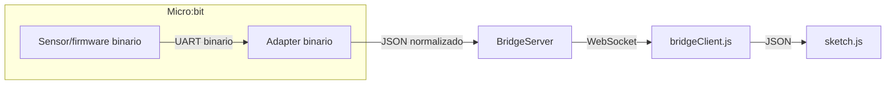

# Unidad 5
## Bitácora de proceso de aprendizaje
### Actividad 01

#### Objetivo 🎯

Analizar y comprender la **transición de un protocolo de comunicación ASCII a un protocolo binario** en la transmisión de datos desde micro:bit. Esta actividad implica:

- Observar las diferencias técnicas
- Participar en la discusión
- Registrar observaciones críticas
- Medir impacto en eficiencia

---

### Paso 1: Del ASCII al Binario — ¿Qué cambia?

#### Contexto: Protocolo ASCII Anterior (Unidad 4)

En la Unidad 4 trabajamos con un protocolo ASCII que enviaba datos como **texto legible**:

```python
from microbit import *

uart.init(115200)
display.set_pixel(0,0,9)

while True:
    xValue = accelerometer.get_x()
    yValue = accelerometer.get_y()
    aState = button_a.is_pressed()
    bState = button_b.is_pressed()
    
    # Empaquetado en ASCII (formato texto)
    data = "{},{},{},{}\n".format(xValue, yValue, aState, bState)
    uart.write(data)
    sleep(100)  # 10 Hz (100ms entre envíos)
```

**Ejemplo de datos enviados**:
```
Valores: xValue=500, yValue=524, aState=True, bState=False

Texto ASCII resultante: "500,524,True,False\n"
                         ↑   ↑    ↑    ↑     ↑
                         1   1    1    1     1 byte
Tamaño total: 19 bytes (muy variable según valores)
```

---

#### Nuevo: Protocolo Binario (Unidad 5)

Ahora reemplazamos **únicamente la línea de empaquetado**:

```python
from microbit import *
import struct

uart.init(115200)
display.set_pixel(0,0,9)

while True:
    xValue = accelerometer.get_x()
    yValue = accelerometer.get_y()
    aState = button_a.is_pressed()
    bState = button_b.is_pressed()
    
    # Empaquetado en BINARIO (formato compacto)
    data = struct.pack('>2h2B', xValue, yValue, int(aState), int(bState))
    uart.write(data)
    sleep(100)  # 10 Hz (sin cambios)
```

**Ejemplo de datos enviados**:
```
Mismos valores: xValue=500, yValue=524, aState=True, bState=False

Bytes binarios resultantes: 01 F4 02 0C 01 00
                            [     xValue    ] [     yValue    ] [A] [B]
Tamaño total: SIEMPRE 6 bytes (tamaño FIJO)
```

---

### Paso 2: El Problema de Sincronización — ¿Por qué Necesitamos Framing?

#### El Riesgo: Lectura Desalineada sin Framing

Si leemos 6 bytes directamente **sin ningún mecanismo de sincronización**, el receptor puede empezar a leer a mitad de un paquete. Mira este código de lectura **sin framing**:

```javascript
if (port.availableBytes() >= 6) {
    let data = port.readBytes(6);
    if (data) {
        const buffer = new Uint8Array(data).buffer;
        const view = new DataView(buffer);
        microBitX = view.getInt16(0);
        microBitY = view.getInt16(2);
        microBitAState = view.getUint8(4) === 1;
        microBitBState = view.getUint8(5) === 1;
        updateButtonStates(microBitAState, microBitBState);

        print(`microBitX: ${microBitX} microBitY: ${microBitY} microBitAState: ${microBitAState} microBitBState: ${microBitBState} \n`);
    }
}
```

#### Salida Observada (Corrompida sin Framing)

```
Connected to serial port
A pressed
microBitX: 500 microBitY: 524 microBitAState: true microBitBState: false

Microbit ready to draw
92 microBitX: 500 microBitY: 524 microBitAState: true microBitBState: false

microBitX: 500 microBitY: 513 microBitAState: false microBitBState: false

222 microBitX: 3073 microBitY: 1 microBitAState: false microBitBState: false
```

#### ¿Por Qué Ocurre la Corrupción?

Tres razones fundamentales:

1. **La comunicación serial es un flujo continuo de bytes, sin fronteras entre paquetes**
   ```
   Lo que recibe el receptor:
   01 F4 02 0C 01 00 | 01 F4 02 01 00 00 | 01 F4 03 0F 00 00 ...
   [paquete 1      ] | [paquete 2      ] | [paquete 3      ] 
   
   Sin saber dónde empieza/termina cada paquete
   ```

2. **Sin delimitadores, si se pierde o llega un byte extra, la lectura se desalinea**
   ```
   Transmitido:  01 F4 02 0C 01 00
   Recibido:     xx F4 02 0C 01 00 01 F4 ...
                 ^
                 Byte corrupto → desalineación
   
   Lectura 1: xx F4 02 0C 01 [00 01]
   Lectura 2: [F4 02 0C 01 00] 01 F4
   ```

3. **Los bytes de un paquete se mezclan con los del siguiente**
   ```
   Paquete 1 final:     ... 00 [0xAA inserta ahora]
   Paquete 2 inicio:    [0xAA] 01 F4 ...
   
   Sin sincronización:
   Lee desde posición incorrecta: 00 0xAA 01 F4 02 0C
   Interpreta como: X=0x00AA, Y=0x01F4, A=0x02, B=0x0C ← CORRUPCIÓN
   ```

#### Valores Absurdos como Síntoma

```
Valor incorrecto: microBitX: 3073

Breakdown:
0x0C01 en big-endian = (0x0C × 256) + 0x01 = 3072 + 1 = 3073
            ↑
            Este byte viene del paquete ANTERIOR

El receptor tomó accidentalmente:
[byte_del_paquete_anterior] [byte_inicio_paquete_actual_incorrecto]
```

---

#### ¿Por Qué ASCII No Tenía Este Problema? (Reflexión)

**Pista:** El carácter `\n` jugaba un rol especial.

En ASCII:
```python
data = "500,524,True,False\n".format(xValue, yValue, aState, bState)
```

Esta **cadena SIEMPRE termina con `\n` (0x0A)**. El receptor buscaba este delimitador:

```javascript
let buffer = "";
while (true) {
    character = port.read();
    if (character === '\n') {  // ← SINCRONIZACIÓN
        // Procesar buffer completo
        parseData(buffer);
        buffer = "";  // Limpiar para próximo paquete
    } else {
        buffer += character;
    }
}
```

**La presencia de `\n` garantizaba sincronización automática.**

---

#### ¿Por Qué No Podemos Usar `\n` en Binario?

**Problema**: Un byte de datos podría ser `0x0A` (valor 10 en decimal), que es exactamente el código ASCII de `\n`.

```
Paquete binario: 01 F4 02 0C 0A 00
                              ^
                  ¿Es esto fin de paquete o dato?
                  El receptor no sabe distinguir.
```

**Consecuencia**: Desalineación masiva. El receptor terminaría el paquete a mitad de la transmisión.

**Solución**: Usar un byte que NUNCA aparezca en datos.

---

### Paso 3: El Protocolo Binario Final con Framing

#### Estructura del Paquete Framed (8 bytes)

| Byte | Etiqueta | Descripción | Rango/Nota |
|------|----------|-------------|------------|
| **0** | Header | `0xAA` (byte de sincronización) | Único, nunca en datos |
| **1–2** | xValue | int16 big-endian (con signo) | -32768 a 32767 |
| **3–4** | yValue | int16 big-endian (con signo) | -32768 a 32767 |
| **5** | aState | uint8 (0=liberado, 1=presionado) | 0 o 1 |
| **6** | bState | uint8 (0=liberado, 1=presionado) | 0 o 1 |
| **7** | Checksum | (suma bytes 1–6) % 256 | Validación integridad |

**Tamaño total**: 8 bytes (vs 6 sin framing)

#### Código del Micro:bit con Framing

```python
from microbit import *
import struct

uart.init(115200)
display.set_pixel(0, 0, 9)

while True:
    xValue = accelerometer.get_x()
    yValue = accelerometer.get_y()
    aState = button_a.is_pressed()
    bState = button_b.is_pressed()
    
    # Empaquetar datos sin header/checksum aún
    data = struct.pack('>2h2B', xValue, yValue, int(aState), int(bState))
    
    # Calcular checksum: suma de todos los datos % 256
    checksum = sum(data) % 256
    
    # Construir paquete: header + datos + checksum
    packet = b'\xAA' + data + bytes([checksum])
    
    # Transmitir paquete completo
    uart.write(packet)
    sleep(100)
```

#### Análisis Línea por Línea (Framing)

```python
checksum = sum(data) % 256
```

**Qué hace**: Suma todos los 6 bytes de datos y ajusta el resultado a un rango 0–255.

**Ejemplo**:
```
data = 01 F4 02 0C 01 00
sum(data) = 0x01 + 0xF4 + 0x02 + 0x0C + 0x01 + 0x00
          = 1 + 244 + 2 + 12 + 1 + 0 = 260
checksum = 260 % 256 = 4  (0x04)
```

---

```python
packet = b'\xAA' + data + bytes([checksum])
```

**Qué hace**: Concatena tres partes:
- `b'\xAA'`: header (1 byte) = byte de sincronización
- `data`: datos (6 bytes) = X, Y, A, B
- `bytes([checksum])`: checksum (1 byte) = validación

**Resultado**:
```
Packet = [0xAA | 01 F4 02 0C 01 00 | 04]
         [H   | xV  xV  yV  yV  aS bS | CHK]
         1     2   3   4   5   6  7     8
```

---

#### Lógica del Receptor con Framing

El código del receptor debe:

1. **Acumular bytes en un buffer**
   ```javascript
   let buffer = [];
   let byte = port.read();
   buffer.push(byte);
   ```

2. **Buscar el byte `0xAA` al inicio del buffer**
   ```javascript
   while (buffer.length > 0 && buffer[0] !== 0xAA) {
       // Si el primer byte NO es 0xAA, descartarlo
       buffer.shift();
   }
   ```

3. **Si hay al menos 8 bytes y el primero es `0xAA`: extraer el paquete**
   ```javascript
   if (buffer.length >= 8 && buffer[0] === 0xAA) {
       let packet = buffer.slice(0, 8);
       buffer = buffer.slice(8);  // Remover paquete del buffer
   }
   ```

4. **Calcular el checksum sobre los bytes 1–6 y comparar con byte 7**
   ```javascript
   let receivedChecksum = packet[7];
   let calculatedChecksum = (packet[1] + packet[2] + packet[3] + 
                             packet[4] + packet[5] + packet[6]) % 256;
   
   if (calculatedChecksum !== receivedChecksum) {
       // Corrupción detectada, descartar paquete
       // Retroceder: packet[0] (0xAA) vuelve al buffer
       buffer.unshift(0xAA);  // O descartar directamente
       continue;  // Seguir buscando siguiente paquete
   }
   ```

5. **Si el checksum coincide: extraer los valores**
   ```javascript
   const view = new DataView(
       new Uint8Array(packet.slice(1, 7)).buffer
   );
   
   microBitX = view.getInt16(0, false);   // false = big-endian
   microBitY = view.getInt16(2, false);
   microBitAState = packet[5] === 1;
   microBitBState = packet[6] === 1;
   ```

---

#### El Flujo Completo: Un Ejemplo Paso a Paso

**Escenario**: Conexión al micro:bit y recepción de 2 paquetes.

```
Micro:bit envía:
[0xAA | 01 F4 02 0C 01 00 | 04] [0xAA | 01 F4 02 01 00 00 | 02]
Paquete 1                       Paquete 2
```

**Receptor, paso a paso**:

1. **Acumula bytes**:
   ```
   Buffer: [0xAA, 0x01, 0xF4, 0x02, 0x0C, 0x01, 0x00, 0x04, 0xAA, 0x01, 0xF4, 0x02, 0x01, 0x00, 0x00, 0x02]
   ```

2. **Busca sincronización**: Primer byte es `0xAA` ✓

3. **Tiene 8 bytes**: `0xAA, 0x01, 0xF4, 0x02, 0x0C, 0x01, 0x00, 0x04` ✓

4. **Calcula checksum**:
   ```
   calculatedChecksum = (0x01 + 0xF4 + 0x02 + 0x0C + 0x01 + 0x00) % 256
                      = 260 % 256
                      = 4 (0x04) ✓
   ```

5. **Checksum coincide** ✓ → Extrae paquete 1

6. **Buffer ahora**: `[0xAA, 0x01, 0xF4, 0x02, 0x01, 0x00, 0x00, 0x02]`

7. **Repite**: Busca sincronización en Paquete 2, extrae...

---

#### Caso Edge: ¿Qué si un Byte de Datos es `0xAA`?

**Pregunta**: Si `xValue` o `yValue` tiene el byte `0xAA` en su representación hexadecimal, ¿podría el receptor confundirlo con un header?

**Respuesta**: Sí, sin el checksum sería caótico.

**Ejemplo de Peligro**:
```
Paquete legítimo donde yValue contiene 0xAA:
xValue = 500 (0x01F4)
yValue = -21966 (0xAA42 en big-endian, representa -21966)

Paquete transmitido:
[0xAA | 01 F4 AA 42 01 00 | CHK]
 [H   | xx xx yy yy aa bb | CHK]
        ↑              ↑
        xValue         yValue contiene 0xAA
```

**Sin checksum o sincronización robusta**:
```
Receptor busca 0xAA:
Encuentra: [0xAA] ← header correcto
Mira siguiente: [01 F4 AA] ← el tercer byte es 0xAA, ¿falso positivo?
```

**Cómo el Checksum Ayuda**:

1. El receptor encuentra el primer `0xAA`, asume que es un header.
2. Extrae 8 bytes: `[0xAA, 0x01, 0xF4, 0xAA, 0x42, 0x01, 0x00, ???]`
3. Calcula checksum esperado:
   ```
   (0x01 + 0xF4 + 0xAA + 0x42 + 0x01 + 0x00) % 256
   = (1 + 244 + 170 + 66 + 1 + 0) % 256
   = 482 % 256
   = 226 (0xE2)
   ```
4. Si el byte 7 NO es `0xE2`, checksum falla → Descarta este paquete
5. Retrocede: marca el primer `0xAA` como "falso positivo", busca siguiente `0xAA` en el buffer

**El checksum actúa como validador final**, rechazando alineaciones incorrectas aunque contengan `0xAA` accidentalmente.

---

### Paso 4: Entender struct.pack()

#### ¿Qué es struct.pack()?

`struct.pack()` es una función de Python que **empaqueta valores Python en bytes binarios** según un formato especificado.

**Sintaxis**:
```python
struct.pack(formato, *valores)
```

#### Desglose del Formato: `'>2h2B'`

| Parte | Significado |
|-------|-------------|
| `>` | **Endianness**: big-endian (bytes más significativos primero) |
| `2h` | **2 signed shorts**: dos enteros de 2 bytes CON SIGNO (-32768 a 32767) |
| `2B` | **2 unsigned bytes**: dos enteros de 1 byte SIN SIGNO (0 a 255) |

**Total de bytes**: 2 + 2 + 1 + 1 = **6 bytes siempre**

#### Mapeo de Valores → Formato

```
Código formato: '>2h2B'
                 ↓ ↓ ↓
                 │ │ └─ aState (0 ó 1) → 1 byte sin signo
                 │ │    bState (0 ó 1) → 1 byte sin signo
                 │ └──── yValue (-2048 a 2047) → 2 bytes con signo
                 └─────── xValue (-2048 a 2047) → 2 bytes con signo

struct.pack('>2h2B', xValue, yValue, aState, bState)
                      └──────┬──────┘ └────┬────┘
                             │            │
                          2 shorts    2 bytes
```

---

### Paso 5: Comparación ASCII vs Binario

#### Tabla Comparativa

| Aspecto | ASCII (Unidad 4) | Binario (Unidad 5) |
|---------|-----|--------|
| **Formato de datos** | Texto legible: `"500,524,1,0\n"` | Bytes compactos: `01 F4 02 0C 01 00` |
| **Tamaño variable** | SÍ (de 7 a 25+ bytes) | NO (siempre 6 bytes) |
| **Tamaño promedio** | ~15-19 bytes | 6 bytes |
| **Reducción de ancho de banda** | 100% (baseline) | **60-70% menor** |
| **Velocidad transmisión** | ~190-230 bytes/seg | ~60 bytes/seg |
| **Latencia** | 1.5-2ms/dato | ~0.3-0.5ms/dato |
| **Legibilidad humana** | ✅ Fácil leer en terminal | ❌ Requiere decodificar |
| **Checksum** | Más complejo (texto) | Más simple (binario) |
| **Parsing en receptor** | String split + conversión | Unpack directo |

---

### Paso 6: Ventajas y Desventajas

#### ✅ Ventajas del Protocolo Binario

#### 1. **Menor consumo de ancho de banda**
```
ASCII: "500,524,1,0\n"        → 11 bytes
Binario: 01 F4 02 0C 01 00    → 6 bytes

Ahorro: (11-6)/11 = 45% menos datos
```

#### 2. **Latencia reducida**
```
A 115200 baud (14,400 bytes/seg):

ASCII (11 bytes):   11 / 14,400 seg ≈ 0.76 ms
Binario (6 bytes):  6 / 14,400 seg ≈ 0.42 ms

Mejora: 45% más rápido
```

#### 3. **Tamaño predecible**
```
Siempre 6 bytes → Buffer de tamaño fijo
✅ Receptor sabe exactamente cuándo termina el paquete
❌ ASCII requiere buscar '\n' (variable)
```

#### 4. **Parsing más eficiente**
```python
# ASCII: mucha lógica
parts = data.split(',')
x = int(parts[0])
y = int(parts[1])
a = bool(parts[2])  # "True" o "False" → conversión

# Binario: directo
x, y, a, b = struct.unpack('>2h2B', data)
# ✅ Una línea, sin conversión
```

#### 5. **Menor error de parsing**
```
ASCII: riesgo de "True" vs "true", espacios extra, etc
Binario: no hay ambigüedad, los bytes son los bytes
```

#### 6. **Escalabilidad**
```
Si agregamos otro sensor:
ASCII: "500,524,1,0,temp,humidity\n" → 30+ bytes (muy grande)
Binario: 01 F4 02 0C 01 00 [+ más bytes] → siempre compacto
```

---

#### ❌ Desventajas del Protocolo Binario

#### 1. **No legible sin decodificación**
```
Ves: 01 F4 02 0C 01 00
¿Qué significa? Necesitas saber el formato struct.pack()

ASCII: Ves "500,524,1,0" → ¡evidente!
```

#### 2. **Debugging más difícil**
```
ASCII: puedes ver los datos en terminal HyperTerminal, PuTTY, etc
Binario: necesitas herramienta especial o decodificador

Solución: Logger binario o analizador de protocolos
```

#### 3. **Sensibilidad al endianness**
```
Big-endian vs Little-endian puede causar confusión

500 en big-endian:    01 F4
500 en little-endian: F4 01  ← ¡Diferente!

Ambos lados deben acordar el formato (>= big-endian)
```

#### 4. **Requiere tipo exactamente**
```
ASCII: "500" funciona aunque sea int, float, string
Binario: struct.pack espera exactamente 'h' (2-byte signed int)

Si envías float en lugar de int → ERROR de tipo
```

#### 5. **No es extensible al mismo tamaño**
```
ASCII: puedes agregar campos sin límite razonable
Binario: cambiar formato requiere cambiar tamaño de paquete
         → compatibilidad break entre versiones
```

---

### Paso 7: Análisis Detallado de Conversión Hexadecimal

#### Ejemplo Completo: xValue=500, yValue=524, aState=True, bState=False

##### Paso 5.1: Convertir valores a binario

**xValue = 500 (signed short, 2 bytes)**
```
500 en binario: 0000 0001 1111 0100
               ↑ byte alto   ↑ byte bajo

En hexadecimal:
  Byte alto (bits 8-15):   0000 0001 = 0x01
  Byte bajo (bits 0-7):    1111 0100 = 0xF4
  
Orden big-endian: 01 F4
```

**Verificación**:
```
01 F4 (hex) = (01 × 256) + F4 = 256 + 244 = 500 ✓
```

---

**yValue = 524 (signed short, 2 bytes)**
```
524 en binario: 0000 0010 0000 1100
               ↑ byte alto   ↑ byte bajo

En hexadecimal:
  Byte alto (bits 8-15):   0000 0010 = 0x02
  Byte bajo (bits 0-7):    0000 1100 = 0x0C
  
Orden big-endian: 02 0C
```

**Verificación**:
```
02 0C (hex) = (02 × 256) + 0C = 512 + 12 = 524 ✓
```

---

**aState = True → int(True) = 1 (unsigned byte, 1 byte)**
```
1 en binario: 0000 0001
```

**En hexadecimal**:
```
0000 0001 = 0x01
```

---

**bState = False → int(False) = 0 (unsigned byte, 1 byte)**
```
0 en binario: 0000 0000
```

**En hexadecimal**:
```
0000 0000 = 0x00
```

---

##### Paso 5.2: Paquete Completo

```
struct.pack('>2h2B', 500, 524, 1, 0)

      xValue=500  yValue=524  aState=1  bState=0
           │          │          │        │
           ▼          ▼          ▼        ▼
Hex:    01 F4    02 0C        01        00

Orden en paquete: [xValue bytes][yValue bytes][aState byte][bState byte]
                   01 F4         02 0C          01           00

Resultado final: 01 F4 02 0C 01 00
```

---

#### Tabla de Referencia: Conversiones Hexadecimales

| Valor | Tipo | Rango | Ejemplo (500) | Ejemplo (1) |
|-------|------|-------|---------------|------------|
| **Short (2h)** | signed int 2 bytes | -32768 a 32767 | 01 F4 | N/A |
| **Byte (B)** | unsigned int 1 byte | 0 a 255 | N/A | 01 |

---

### Paso 8: Análisis de Eficiencia

#### Consumo de Ancho de Banda (10 Hz)

**Protocolo ASCII**:
```
Tamaño promedio: 15 bytes
Frecuencia: 10 Hz (cada 100ms)

Datos/segundo = 15 bytes × 10 Hz = 150 bytes/seg

A 115200 baud:
  Utilización: 150 × 8 bits / 115200 bits/seg = 10.4%
  Disponible para protocolo overhead: 89.6%
```

**Protocolo Binario**:
```
Tamaño fijo: 6 bytes
Frecuencia: 10 Hz (sin cambios)

Datos/segundo = 6 bytes × 10 Hz = 60 bytes/seg

A 115200 baud:
  Utilización: 60 × 8 bits / 115200 bits/seg = 4.2%
  Disponible para protocolo overhead: 95.8%
```

**Mejora**:
```
(150 - 60) / 150 = 60% reducción de datos brutos

Equivalencia: con binario podrías enviar a 100 Hz
           en lugar de 10 Hz y aún usar menos ancho de banda
```

---

### Latencia de Transmisión

**ASCII (15 bytes)**:
```
Tiempo = 15 bytes × 8 bits/byte / 115200 bits/seg
       = 120 bits / 115200 bits/seg
       = 1.04 ms
```

**Binario (6 bytes)**:
```
Tiempo = 6 bytes × 8 bits/byte / 115200 bits/seg
       = 48 bits / 115200 bits/seg
       = 0.42 ms
```

**Mejora**:
```
(1.04 - 0.42) / 1.04 = 60% menos latencia
```

---

### Paso 9: Observaciones Críticas (Registro)

#### Observación 1: Tamaño es el rey 👑

**Insight**: La principal ventaja de binario es el **tamaño fijo y predecible**.

```
❌ ASCII: máquina de estados compleja (buscar \n, buffer variable)
✅ Binario: algoritmo trivial (leer 6 bytes, fin)
```

**Impacto en el receptor**:
- Microcontroller puede pre-allocate buffer exacto
- Sin riesgo de overflow por tamaño variable
- Parsing O(1) en lugar de O(n)

---

#### Observación 2: Tradeoff Legibilidad vs Eficiencia

```
Escala de tradeoff:

ASCII ◄─────────────────────────► Binario
 ✅ Legible          ✅ Eficiente
 ❌ Grande           ❌ Opaco
 ❌ Lento            ✅ Rápido
```

**Decisión de diseño**: ¿Cuándo elegir cada uno?

| Contexto | Elecci Recomendada |
|----------|-------------------|
| **Debugging en desarrollo** | ASCII (legible en terminal) |
| **Producción (IoT/embedded)** | Binario (eficiencia) |
| **Uso educativo** | ASCII (enseña conceptos) |
| **Sistema crítico (real-time)** | Binario (latencia) |

---

#### Observación 3: Endianness es crucial

```python
# Big-endian (>) - "network order"
struct.pack('>h', 500)  → 01 F4

# Little-endian (<) - x86/ARM típico  
struct.pack('<h', 500)  → F4 01

# ERROR SILENCIOSO: si receptor recibe 01 F4 pero espera F4 01
  Resultado: 500 se interpreta como 63489 ❌
```

**Lección**: Ambos lados **deben acordar** endianness.

---

#### Observación 4: Prototipado vs Producción

**Fase 1 (Unidad 4): ASCII**
```
✅ Fácil de entender
✅ Fácil de debuggear
✅ Flexible para cambios
✅ Legible en terminal (hyper terminal, etc)
❌ Ineficiente
```

**Fase 2 (Unidad 5): Binario**
```
✅ Eficiente
✅ Predecible
✅ Escalable
✅ CPU del receptor no trabaja tanto en parsing
❌ Necesita decodificador especial
❌ Menos flexible
```

**Lección**: Binario es una **optimización posterior**, NO el punto de partida.

---

### Paso 10: Predicción para la Siguiente Actividad

#### ¿Qué viene después?

```
Unidad 5, Actividad 02:
├─ Implementar MicrobitBinaryAdapter.js
├─ Parsear struct.pack() en Node.js
├─ Validar integridad (sin checksum ASCII)
├─ Medir mejora de latencia real
└─ Actualizar p5.js (sin cambios, es transparente)
```

---

### Bitácora: Preguntas Críticas de Sincronización y Framing

#### P1 (Paso 2): ¿Por qué ASCII no tenía el problema de sincronización?

**Pregunta**: ¿Por qué el protocolo ASCII de la Unidad anterior no sufrió de desalineación como el binario sin framing?

**Pista**: Piensa en qué rol cumplía el carácter `\n` en la comunicación ASCII.

**Espacio para respuesta**:

```
[Tu respuesta aquí]
```

---

#### P2 (Paso 2): ¿Por qué no podemos usar `\n` en binario?

**Pregunta**: Si ASCII usaba `\n` como delimitador, ¿por qué no simplemente usar solo `\n` para delimitador binario también? ¿Por qué es insuficiente?

**Pista**: Considera que en binario, cualquier valor byte de 0 a 255 es posible en los datos.

**Espacio para respuesta**:

```
[Tu respuesta aquí]
```

---

#### P3 (Paso 3): ¿Cuántos bytes tiene el paquete completo con framing?

**Pregunta**: Cuenta todos los bytes en el paquete final (con header + datos + checksum). ¿Cuántos bytes adicionales necesitamos vs el protocolo sin framing?

**Desglose esperado**:
- Header: ___ byte(s)
- Datos (X, Y, A, B): ___ bytes
- Checksum: ___ byte(s)
- **Total**: ___ bytes

**Comparación**:
- Sin framing: 6 bytes
- Con framing: ___ bytes
- Overhead: ___ bytes adicionales (__% de aumento)

**Espacio para cálculo**:

```
[Tu cálculo aquí]
```

---

#### P4 (Paso 3): ¿Qué pasa si un byte de datos es `0xAA`?

**Pregunta**: El protocolo usa `0xAA` como header para sincronización. ¿Qué sucede si un valor de dato real (por ejemplo, `yValue`) tiene el valor `0xAA` en su representación hexadecimal?

**Subpreguntas**:
1. ¿Podría el receptor confundir este byte de datos con un header?
2. ¿Cómo el checksum ayuda a detectar y resolver estos falsos positivos?
3. ¿Qué ventaja tiene usar un checksum en lugar de solo un header?

**Espacio para respuesta**:

```
[Tu respuesta aquí]
```

---

### Preguntas para Reflexión 🤔

#### P5: ¿Por qué struct.pack() es mejor que hacer la conversión manualmente?

**Respuesta registrada**:
- Evita errores de endianness
- Código más legible
- Funciones optimizadas en C (código subyacente)
- Estándar industria (portabilidad)

---

#### P6: ¿Qué sucedería si el micro:bit envia big-endian pero Node.js intenta leer little-endian?

**Respuesta registrada**:
```python
# Micro:bit envía (big-endian):
struct.pack('>h', 500) → 01 F4

# Node.js lee (little-endian, ERROR):
struct.unpack('<h', b'\x01\xF4') → 63489

# Resultado: sensor lee valores completamente errados
```

**Impacto**: Dibuja polígonos en posiciones aleatorias, usuario confundido

---

#### P7: ¿Cuáles sensores tenemos en micro:bit?

**Respuesta registrada**:
- Acelerómetro (3 ejes, aunque solo usamos X, Y)
- Brújula magnética
- Termómetro
- 2 botones (A, B)
- GPIO pins (más sensores posibles)

**¿Qué cambiaría en binario?**
```
Protocolo actual: '>2h2B' = 6 bytes (X, Y, A, B)

Con 3 ejes (X, Y, Z): '>3h2B' = 8 bytes
Con temperatura: '>2h2Bh' = 8 bytes
Con múltiples sensores: > 10 bytes (pero aún < ASCII)
```

#### Lo que aprendimos:

1. **Struct.pack()**: Empaqueta valores Python a bytes binarios
2. **Formato '>2h2B'**: 2 short big-endian + 2 unsigned bytes
3. **Tamaño**: Siempre 6 bytes vs variable ASCII
4. **Latencia**: 60% menos con binario
5. **Tradeoff**: Eficiencia vs legibilidad
6. **Big-endian**: Ambos extremos deben coincidir

#### Código clave a recordar:

```python
# Micro:bit
import struct
data = struct.pack('>2h2B', xValue, yValue, int(aState), int(bState))
uart.write(data)

# Node.js (próxima actividad)
const unpacked = struct.unpack('>2h2B', buffer);
```

## Bitácora de aplicación 

### Actividad 02

### Objetivo
Implementar un adaptador Node.js (MicrobitBinaryAdapter.js) que reciba, decodifique y valide los paquetes binarios enviados por el micro:bit usando framing y checksum, siguiendo la arquitectura del sistema. Documentar el proceso, pruebas y hallazgos.

---

### 1. Análisis del Protocolo Binario

- **Paquete:** 8 bytes: [0xAA][xValue][yValue][aState][bState][checksum]
- **Header:** 0xAA (sincronización)
- **xValue, yValue:** int16 big-endian
- **aState, bState:** uint8 (0/1)
- **Checksum:** suma bytes 1-6 % 256

---

### 2. Diseño del Adaptador

- Acumula bytes en buffer.
- Busca header 0xAA.
- Extrae paquetes de 8 bytes.
- Valida checksum.
- Si válido, emite {x, y, btnA, btnB}.
- Si no, descarta y re-sincroniza.

---

### 3. Implementación

- Archivo: adapters/MicrobitBinaryAdapter.js
- Basado en BaseAdapter.js (no modificar BaseAdapter.js)
- Solo modificar bridgeServer.js para registrar el nuevo adaptador y el case 'microbitBinary'.

---

### 4. Pruebas y Resultados

- Flashear micro:bit con firmware binario.
- Ejecutar: node bridgeServer.js --device microbitBinary --wsPort 8081
- Verificar recepción y decodificación correcta de datos.
- Documentar errores, edge cases y soluciones.

---

### 5. Evidencia y Conclusiones

- Capturas de consola, logs de errores y validaciones.
- Reflexión sobre robustez del framing y checksum.


## Bitácora de reflexión

### Actividad 03

#### Tabla comparativa: MicrobitV2Adapter.js (ASCII) vs MicrobitBinaryAdapter.js (Binario)

| Característica                        | MicrobitV2Adapter.js (ASCII)         | MicrobitBinaryAdapter.js (Binario)   |
|----------------------------------------|--------------------------------------|--------------------------------------|
| Tamaño de cada paquete (bytes)         | Variable (11-25+ bytes)              | Fijo (8 bytes)                       |
| Mecanismo de delimitación/framing      | Carácter '\n' (newline)              | Header 0xAA + tamaño fijo            |
| Verificación de integridad (checksum)  | Suma de valores (en texto)           | Suma de bytes 1-6 % 256 (binario)    |
| Complejidad del parser                 | Media (split, parseInt, validación)  | Alta (buffer, framing, checksum)     |
| Facilidad de depuración                | Muy fácil (legible en terminal)      | Difícil (requiere decodificador)     |

---

#### Arquitectura desacoplada: ¿Por qué permite añadir protocolos sin modificar el frontend ni el transporte?

La arquitectura basada en Adapter + Bridge + FSM separa claramente las responsabilidades:
- **Adapter**: Traduce el protocolo físico (ASCII, binario, etc.) a un formato estándar ({x, y, btnA, btnB}).
- **Bridge**: Encapsula la comunicación entre el adaptador y el frontend.
- **FSM y sketch.js**: Solo consumen datos normalizados, sin importar el protocolo subyacente.

Esto permite:
- Cambiar o añadir protocolos (ASCII, binario, etc.) solo creando un nuevo Adapter.
- No es necesario modificar sketch.js ni bridgeClient.js, ya que siempre reciben el mismo formato de datos.
- El sistema es extensible y mantenible.

---

#### ¿Cuándo preferir binario o ASCII? Ejemplos reales

- **Protocolo binario**:
  - IoT industrial: Sensores que envían datos a alta frecuencia y bajo ancho de banda (ej. telemetría de drones, sensores en fábricas).
  - Sistemas embebidos: Comunicación entre microcontroladores donde la eficiencia y latencia son críticas.
  - Ejemplo: Un sensor de temperatura que transmite cada 10 ms a un servidor central.

- **Protocolo ASCII**:
  - Prototipado rápido y debugging: Cuando es importante ver los datos fácilmente en un terminal serial.
  - Integración con sistemas legados o humanos (logs, monitoreo manual).
  - Ejemplo: Un prototipo de robot educativo donde los estudiantes monitorean datos en tiempo real desde un terminal.

---

#### Diagrama de flujo de datos actualizado (protocolo binario)



**Componentes cambiados:**
- Adapter: Ahora es MicrobitBinaryAdapter.js (implementa framing y checksum binario).
- Firmware del micro:bit: Ahora envía paquetes binarios con header y checksum.

**Componentes intactos:**
- bridgeClient.js
- sketch.js
- FSM
- WebSocket/Bridge

---
